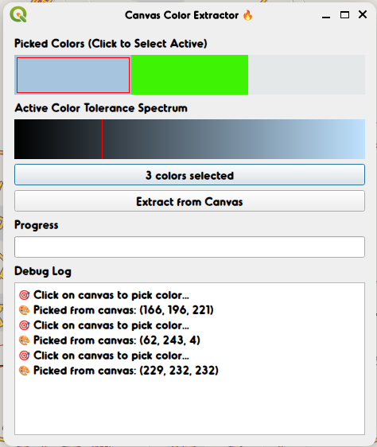
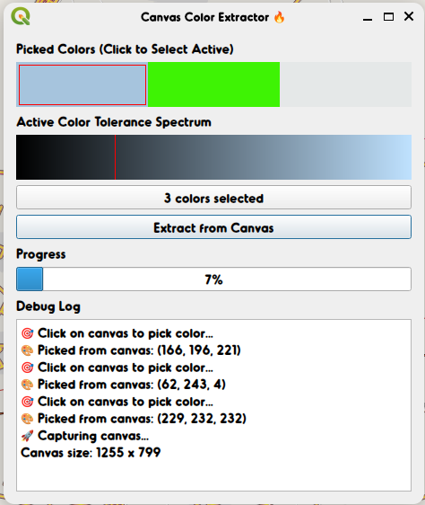
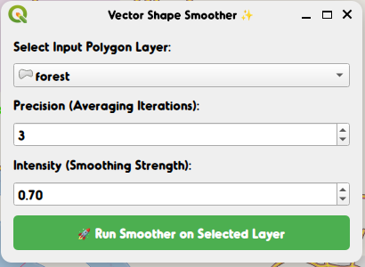

# 🎨 Color Snap Polygon `v1.0`

> **QGIS Plugin for Color-Based Area Extraction & Digitization**

[](https://qgis.org/)
[](https://opensource.org/licenses/MIT)
[](#)

Draw polygons automatically snapping to selected colors directly from the QGIS canvas. This tool utilizes an advanced pixel-based region-growing algorithm to trace contiguous color areas, making complex digitization tasks fast and precise. Part of the **Ineffable Tools** suite.

---

## 📸 Visual Workflow

<p align="center">
  
  
</p>
<p align="center">
  
</p>

---

## 🔥 Key Features

- **🎯 Interactive Color Picking**: Use the dedicated map tool to sample colors directly from any visible layer on the QGIS canvas.
- **🌈 Multi-Color Selection**: Pick and manage multiple color swatches to extract complex multi-tonal features in one go.
- **🎚️ Spectrum Tolerance Control**: Fine-tune the extraction sensitivity with an interactive Value (Brightness) spectrum preview.
- **✨ Boundary Smoothing**: Intelligent post-processing applying buffer, smoothing, and simplification to create clean vector shapes.
- **💾 Memory Layer Integration**: Automatically saves and merges extractions into a high-speed memory layer for instant viewing.

---

## 🛠️ Installation

1. **Locate Plugin Directory**:
   Open terminal and navigate to your QGIS plugins folder:

   ```bash
   cd ~/.local/share/QGIS/QGIS3/profiles/default/python/plugins/
   ```

2. **Clone the Repository**:

   ```bash
   git clone https://github.com/ineffablexd/color_snap_and-polygon_extractor.git
   ```

3. **Reload QGIS**:
   Restart QGIS or use the **Plugin Reloader** to activate the tool. You'll find it under the `Ineffable Tools` menu.

---

## 📖 How to Use

1. **Launch the Tool**: Open the **Canvas Color Extractor** from the `Ineffable Tools` top-level menu.
2. **Sample Colors**: Click **Pick Color** and select the target regions on your map canvas. You can pick multiple colors.
3. **Refine Tolerance**: Use the **Active Color Tolerance Spectrum** sliders to adjust how much brightness variation is allowed.
4. **Generate Vector**: Click **Extract from Canvas**. The plugin will process the current view and add a new layer named `Extracted`.
5. **Iterate**: New extractions will automatically merge with existing features in the `Extracted` layer, allowing for additive workflows.

---

<p align="center">
  Made with ❤️ by <b><a href="https://github.com/ineffablexd">Ineffable</a></b>
</p>

<p align="center">
  <i>Part of the Ineffable Tools Suite for QGIS</i>
</p>
